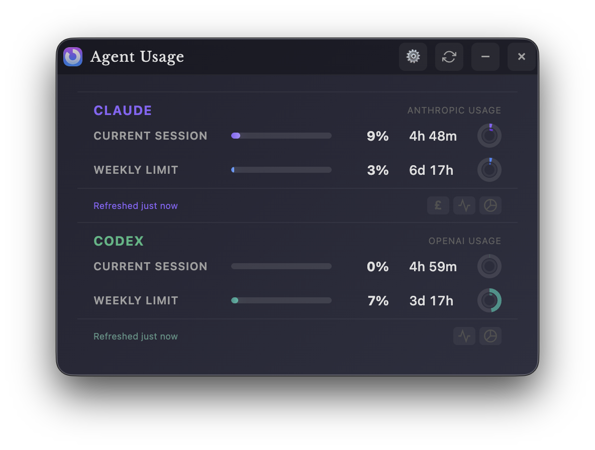

# Agent Usage App

A beautiful, standalone Windows, Mac and Linux desktop app that displays your Claude.ai usage statistics in real-time.



## Features

- 🎯 **Real-time Usage Tracking** - Monitor both session and weekly usage limits
- 🏢 **Multiple Organizations** - If your Claude account belongs to several orgs (e.g. an enterprise and a team plan), each one gets its own usage section
- 📊 **Visual Progress Bars** - Clean, gradient progress indicators
- ⏱️ **Countdown Timers** - Circular timers showing time until reset
- 🔄 **Auto-refresh** - Updates every 5 minutes by default (changeable in Settings)
- 🚀 **Auto-start** - Optional system startup launch (Windows & macOS)
- 🎨 **Theme Picker** - Switch between Purple, Lilac, Orange, Green, and Metallic palettes
- 🌓 **Adaptive Styling** - Theme changes update the widget background plus distinct Claude and Codex colors
- 🔒 **Secure** - Encrypted credential storage
- 📍 **Always on Top** - Stays visible across all workspaces
- 💾 **System Tray** - Minimizes to tray for easy access

## Installation

### Download Pre-built Release

1. Download the latest `Agent-Usage-App-Setup.exe` from [Releases](https://github.com/jayjaybeeuk/claude-usage-app/releases)
2. Run the installer
3. Launch "Agent Usage Widget" from Start Menu

### Build from Source

**Prerequisites:**

- Node.js 22.12+ ([Download](https://nodejs.org))
- npm (comes with Node.js)
- Rust stable toolchain ([rustup.rs](https://rustup.rs)) — the app is built with Tauri v2
- Platform build tools: Xcode Command Line Tools (macOS), MSVC Build Tools + WebView2 (Windows), `webkit2gtk` dev packages (Linux)

**Steps:**

```bash
# Clone the repository
git clone https://github.com/jayjaybeeuk/claude-usage-app.git
cd claude-usage-app

# Install dependencies
npm install

# Run in development mode (tauri dev — starts Vite automatically)
npm run dev

# Run in development mode with verbose auth/debug logging
npm run dev:debug

# Bundle the renderer only
npm run build

# Package an installer/binary for the current platform (DMG/app, NSIS, AppImage/deb)
npm run package
```

Packaged artifacts will be created under `src-tauri/target/release/bundle/`.

> **Note (macOS):** `npm run package` builds the DMG with `CI=true`, which skips the
> Finder-scripted DMG window styling — that step requires Automation permission
> (System Settings → Privacy & Security → Automation → your terminal → Finder) and
> fails on machines where it's not granted. If you want the styled DMG and have the
> permission, use `npm run package:styled`. If a styled build fails partway, detach
> any leftover image with `hdiutil detach` and delete `rw.*.dmg` files under
> `src-tauri/target/release/bundle/macos/` before retrying.

## Usage

### First Launch

1. Launch the widget
2. Click "Login to Claude" when prompted
3. A browser window will open - login to your Claude.ai account
4. The widget will automatically capture your session
5. Usage data will start displaying immediately

### Widget Controls

- **Drag** - Click and drag the title bar to move the widget
- **Refresh** - Click the refresh icon to update data immediately
- **Minimize** - Click the minus icon to hide to system tray
- **Close** - Click the X to minimize to tray (doesn't exit)

### System Tray Menu

Right-click the tray icon for:

- Show/Hide widget
- Refresh usage data
- Re-login (if session expires)
- Open Settings
- Exit application

### Multiple Claude Organizations

If your login has access to more than one organization (for example an enterprise
org and a separate team org), the widget shows them all:

- The **primary org** (the first one Claude returns) keeps the full section —
  progress bars, Sonnet/Opus breakdowns, spending, history graph, and pie chart.
  Its section header shows the org name.
- Each **additional org** gets a compact section below with its own name,
  Current Session and Weekly Limit bars, and countdown timers.
- The tray title and usage history track the primary org.

No extra setup is needed — the org list is detected from your existing login
(including logins made before this feature existed). If an additional org's
data can't be fetched, its section is simply hidden; the primary org is
unaffected.

## Understanding the Display

### Current Session

- **Progress Bar** - Shows usage from 0-100%
- **Timer** - Time remaining until 5-hour session resets
- **Color Coding**:
  - Theme accent: Normal usage (0-74%)
  - Amber: High usage (75-89%)
  - Red: Critical usage (90-100%)

### Weekly Limit

- **Progress Bar** - Shows weekly usage from 0-100%
- **Timer** - Time remaining until weekly reset (Wednesdays 7:00 AM)
- **Same color coding** as session usage

## Configuration

### Auto-start with System (Windows & macOS)

1. Click the ⚙️ **Settings** button in the widget's title bar
2. Toggle **"Start with system"** to enable/disable auto-start
3. The app will automatically launch when you log in to your computer

**Platform Support:**
- ✅ **Windows**: Fully supported
- ✅ **macOS**: Fully supported  
- ❌ **Linux**: Not available (limited desktop environment support)

*Note: The toggle only appears on supported platforms.*

### Custom Refresh Interval

The default interval is controlled by `DEFAULT_REFRESH_MINUTES` in `src/renderer/app.ts` (5 minutes). Users can
override it in the app via **Settings → Auto-refresh** with the slider (1–20 minutes).

### Theme Selection

Use **Settings → Theme color** to switch between the built-in themes:

- Purple
- Lilac
- Orange
- Green
- Metallic

Each theme updates the widget background and keeps Claude and Codex visually distinct with separate accent colors
across section headers, progress states, and charts.

If you want to keep the service colors but change the shell treatment, use **Settings → Background hue** to override
just the widget gradient.

## Troubleshooting

### "Login Required" keeps appearing

- Your Claude.ai session may have expired
- Click "Login to Claude" to re-authenticate
- Check that you're logging into the correct account

### Widget not updating

- Check your internet connection
- Click the refresh button manually
- Ensure Claude.ai is accessible in your region
- Try re-logging in from the system tray menu

### Auth debug logging

If login/usage calls fail, run with debug logging:

```bash
npm run dev:debug
```

Look for lines that begin with:

- `[Auth][Debug] Login cookies:`
- `[Auth][Debug] Usage window fetch failed:`
- `[Auth][Debug] HTTP error`

### Widget position not saving

- Window position is now saved automatically when you drag it
- Position will be restored when you restart the app

### Build errors

```bash
# Clear cache and reinstall
rm -rf node_modules package-lock.json
npm install
```

## Privacy & Security

- Your session credentials are stored **locally only** in the app's data directory
- No data is sent to any third-party servers
- The widget only communicates with Claude.ai official API
- Session cookies live in the OS webview's cookie store (WKWebView on macOS, WebView2 on Windows, WebKitGTK on Linux)
- **Logout** removes the session key from local storage and clears the webview browsing data (cookies, localStorage, caches) so nothing lingers on shared machines

### Session Key Storage Details

The `sessionKey` (a bearer token for Claude.ai) is stored in two places:

| Location                                                                     | Purpose                                          | Cleared on logout? |
| ---------------------------------------------------------------------------- | ------------------------------------------------ | ------------------ |
| `settings.json` in the app data dir (e.g. `~/Library/Application Support/com.claudeusage.widget/`) | Persists credentials between app restarts | Yes                |
| OS webview cookie store (`.claude.ai` domain, `secure`)                      | Used by hidden webview windows for API requests  | Yes                |

Credentials are stored as plain JSON readable only by your OS user account (the old Electron build's "encryption" used a key embedded in the app, which offered equivalent practical protection). For shared machines, always log out when finished.

## Technical Details

**Built with:**

- Tauri v2 (Rust backend, OS webview UI)
- TypeScript (renderer)
- Vite (renderer bundling)
- tauri-plugin-store for local credential storage

**API Endpoint:**

```
https://claude.ai/api/organizations/{org_id}/usage
```

**Storage Location:**

```
<app data dir>/com.claudeusage.widget/settings.json
```

**Debug Mode:**

To enable verbose logging, set the `DEBUG_LOG=1` environment variable:

```bash
DEBUG_LOG=1 npm run dev
# or for a packaged app on macOS:
DEBUG_LOG=1 "/Applications/Agent Usage.app/Contents/MacOS/agent-usage"
```

## Roadmap

- [x] macOS support
- [x] Linux support
- [x] Custom themes
- [ ] Notification alerts at usage thresholds
- [x] Remember window position
- [x] Settings panel
- [x] Usage history graphs
- [ ] Multiple account support
- [ ] Keyboard shortcuts
- [x] Migrate from Electron to Tauri for smaller binary size (~10MB vs ~200MB)

## Contributing

Contributions are welcome! Please feel free to submit a Pull Request.

## License

MIT License - feel free to use and modify as needed.

## Disclaimer

This is an unofficial tool and is not affiliated with or endorsed by Anthropic. Use at your own discretion.

## Support

If you encounter issues:

1. Check the [Issues](issues) page
2. Create a new issue with details about your problem
3. Include your OS version and any error messages

---

Made with ❤️ for the Claude.ai community
